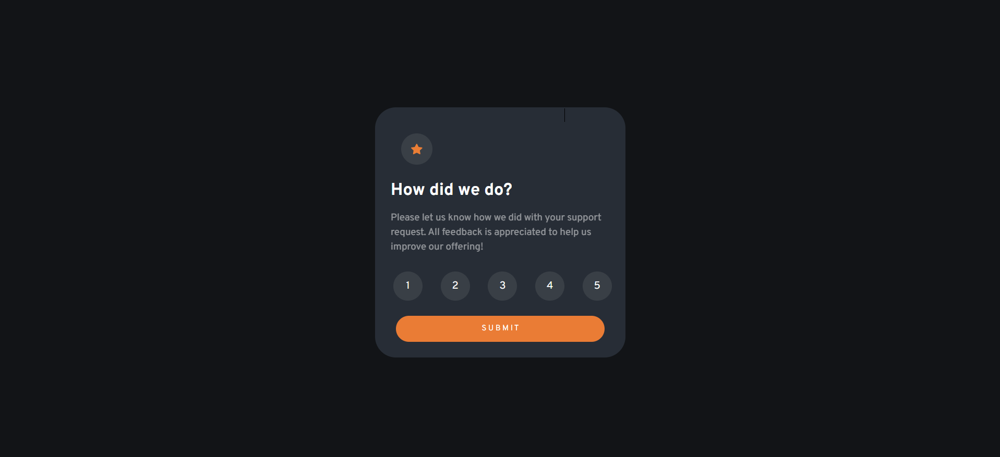

# Frontend Mentor - Interactive rating component solution

This is a solution to the [Interactive rating component challenge on Frontend Mentor](https://www.frontendmentor.io/challenges/interactive-rating-component-koxpeBUmI). Frontend Mentor challenges help you improve your coding skills by building realistic projects.

## Table of contents

- [Overview](#overview)
  - [The challenge](#the-challenge)
  - [Screenshot](#screenshot)
  - [Links](#links)
- [My process](#my-process)
  - [Built with](#built-with)
  - [What I learned](#what-i-learned)
  - [Continued development](#continued-development)
  - [Useful resources](#useful-resources)

## Overview

### The challenge

Users should be able to:

- View the optimal layout for the app depending on their device's screen size
- See hover states for all interactive elements on the page
- Select and submit a number rating
- See the "Thank you" card state after submitting a rating

### Screenshot

### Links

- Solution URL: [solution URL here](https://github.com/Hakxep-wuqpuk-hyrze8/interactive-rating-component-main)
- Live Site URL: [live site URL here](https://hakxep-wuqpuk-hyrze8.github.io/interactive-rating-component-main/)

## My process

### Built with

- Semantic HTML5 markup
- CSS custom properties
- Flexbox
- bootstrap
- JS

### What I learned

How to build website with Javascript.

### Continued development

Make the website more beautiful, and clean the code

### Useful resources

- [Example resource 1](<[https://www.example.com](https://www.w3schools.com/default.asp)>) - This helped me a lot
